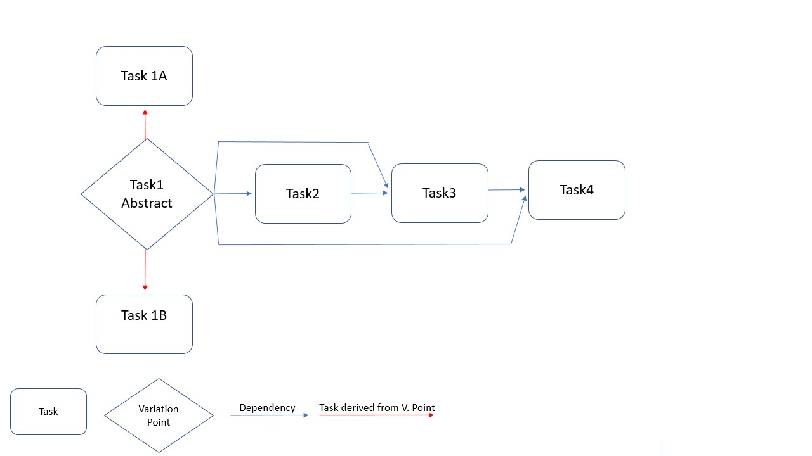

# cls-python


# cls-luigi

cls-luigi generates all feasible luigi pipelines for a given target based on a 
repository of luigi-tasks. 

A luigi tasks that not only inherit from ``luigi.Task`` but also 
from our LuigiCombinator ``inhabitation_task.LuigiCombinator`` are automatically considered as
luigi tasks that are part of the task repository.
All we need to implement is a pure luigi task, i.e., the methods ``run()``, ``output()`` and
``requires()``.

In the following we give a short intro of how to use cls-luigi. For each section, we also 
provide you with a running example in the folder hello_world_examples.

* [Run a pipeline consisting of one task](#rpc) 
* [Define dependencies on other tasks](#dfo)
* [Add variation points](#avp)
* [Variation points as a dependency](#vpa)

## Run a pipeline consisting of one task<a name="rpc"/>

The script for this example is to be found [here](hello_world_examples/hello_world.py)

The following task simply writes "Hello World" to a file ``pure_hello_world.txt``:
````python
import luigi
import inhabitation_task

class WriteFileTask(luigi.Task, inhabitation_task.LuigiCombinator):

    def output(self):
        print("WriteFileTask: output")
        return luigi.LocalTarget('pure_hello_world.txt')

    def run(self):
        print("====== WriteFileTask: run")
        with self.output().open('w') as f:
            f.write("Hello World")
````

If only this task exists, a pipeline simply consists of this task. 
However, we can run it as follows:

````python
from inhabitation_task import RepoMeta
from cls_python import FiniteCombinatoryLogic, Subtypes

if __name__ == "__main__":
    target = WriteFileTask.return_type()
    repository = RepoMeta.repository
    fcl = FiniteCombinatoryLogic(repository, Subtypes(RepoMeta.subtypes))
    inhabitation_result = fcl.inhabit(target)
    max_tasks_when_infinite = 10
    actual = inhabitation_result.size()
    max_results = max_tasks_when_infinite
    if not actual is None or actual == 0:
        max_results = actual
    results = [t() for t in inhabitation_result.evaluated[0:max_results]]
    if results:
        luigi.build(results, local_scheduler=True) # für luigid: local_scheduler = True weglassen!
    else:
        print("No results!")
````

We determine our WriteFileTask as target. 
The repository is automatically generated with all LuigiCombinator tasks.
With fcl.inhabit(target) we ask if an inhabitant for this target exists over this repo.
As the number of resulting variants can be infinite, we only store ``max_tasks_when_infinite`` 
number of inhabitants in the results lists.
All inhabitants (luigi pipelines) are scheduled.

## Define dependencies on other tasks<a name="dfo"/>

The script for this example is to be found [here](hello_world_examples/defining_dependencies.py)

The following task depends on the WriteFileTask.
It reads the file written in the WriteFileTask and substitutes "world" by "welt" and writes
a new file.
To determine this dependency, we define a class variable `write_file_class` and return it
in the `requires` method.
The rest of this class is "pure luigi".

````python
class SubstituteWeltTask(luigi.Task, inhabitation_task.LuigiCombinator):
    write_file_task = inhabitation_task.ClsParameter(tpe=WriteFileTask.return_type())

    def requires(self):
        return self.write_file_task()

    def output(self):
        return luigi.LocalTarget('pure_hello_welt.txt')

    def run(self):
        print("============= NameSubstituter: run")
        with self.input().open() as infile:
            text = infile.read()

        with self.output().open('w') as outfile:
            text = text.replace('World', "Welt")
            outfile.write(text)
````

Let's now define our target as ``target = SubstituteWeltTask.return_type()`` in the scripting
before.

```python
if __name__ == "__main__":
    target = SubstituteWeltTask.return_type()
    ...
```
Then a pipeline with the two tasks is scheduled.

## Add variation points<a name="avp"/>

To determine different pipelines, we have to add variation points.

### Using inheritance
The script for this example is to be found [here](hello_world_examples/generating_variation_by_inheritance.py)


Let's assume as an example that there exist two different variants for substituting the "world" 
string as variation point.
In this case, we define a task ``SubstituteNameTask`` as an abstract class, and propose two concrete 
implementations.

````python
class SubstituteNameTask(luigi.Task, inhabitation_task.LuigiCombinator):
    abstract = True
    
    def requires(self):
        return self.write_file_task()


class SubstituteNameByAnneTask(SubstituteNameTask):
    abstract = False
    write_file_task = inhabitation_task.ClsParameter(tpe=WriteFileTask.return_type())

    def output(self):
        return luigi.LocalTarget('pure_hello_anne.txt')

    def run(self):
        print("============= NameSubstituter: run")
        with self.input().open() as infile:
            text = infile.read()

        with self.output().open('w') as outfile:
            text = text.replace('World', "Anne")
            outfile.write(text)


class SubstituteNameByJanTask(SubstituteNameTask):
    abstract = False
    read_data_task = inhabitation_task.ClsParameter(tpe=WriteFileTask.return_type())

    def output(self):
        return luigi.LocalTarget('pure_hello_jan.txt')

    def run(self):
        print("============= NameSubstituter: run")
        with self.input().open() as infile:
            text = infile.read()

        with self.output().open('w') as outfile:
            text = text.replace('World', "Jan")
            outfile.write(text)
````
As target we use the abstract task ``target = SubstituteNameTask.return_type()``.

As a result three tasks are scheduled: SubstituteNameByAnneTask, SubstituteNameByJanTask and
WriteFileTask.
Note that the WriteFileTask is only scheduled once!

The output looks as follows:
````text
Scheduled 3 tasks of which:
* 3 ran successfully:
    - 1 SubstituteNameByAnneTask(config_index=, write_file_task={"__type__": "inhabitation_task.RepoMeta.WrappedTask", "module": "anne_test_3", "task_class": "WriteFileTask", "arguments": []})
    - 1 SubstituteNameByJanTask(config_index=, write_file_task={"__type__": "inhabitation_task.RepoMeta.WrappedTask", "module": "anne_test_3", "task_class": "WriteFileTask", "arguments": []})
    - 1 WriteFileTask(config_index=)

This progress looks :) because there were no failed tasks or missing dependencies
````

### Using different configurations

The code of this example is to be found [here](hello_world_examples/generating_variation_by_config.py)

Another way to produce variation points is to use different configuration.
Let's consider the same above example for substituting the "world" 
string as variation point.

First we implement both `SubstituteNameByJanTask` and `SubstituteNameByAnneTask` as a normal non-abstract task.
```python
class SubstituteNameByAnneTask(luigi.Task, LuigiCombinator):
    abstract = False
    write_file_task = inhabitation_task.ClsParameter(tpe=WriteFileTask.return_type())

    def requires(self):
        return self.write_file_task()

    def output(self):
        return luigi.LocalTarget('../pure_hello_anne.txt')

    def run(self):
        print("============= NameSubstitute: run")
        with self.input().open() as infile:
            text = infile.read()

        with self.output().open('w') as outfile:
            text = text.replace('World', "Anne")
            outfile.write(text)


class SubstituteNameByJanTask(luigi.Task, LuigiCombinator):
    abstract = False

    write_file_task = inhabitation_task.ClsParameter(tpe=WriteFileTask.return_type())

    def requires(self):
        return self.write_file_task()

    def output(self):
        return luigi.LocalTarget('../pure_hello_jan.txt')

    def run(self):
        print("============= NameSubstitute: run")
        with self.input().open() as infile:
            text = infile.read()

        with self.output().open('w') as outfile:
            text = text.replace('World', "Jan")
            outfile.write(text)
```

Then, in the `FinalTask` We pass both tasks as a single ClsParameter represented by a dictionary,
where the keys are our configuration index (1,2), and the items are the returned type of each task.

Note that defining a domain for our configurations indices is optional.
However, by defining a domain, we are specifying which variant is going to be implemented,
such that variants with configuration indices not in the domain will not be executed. 

````python
class FinalTask(luigi.WrapperTask, LuigiCombinator):
    substitute_name = ClsParameter(tpe={1: SubstituteNameByJanTask.return_type(),
                                        2: SubstituteNameByAnneTask.return_type()})
    config_domain = {1, 2}
    def requires(self):
        return self.substitute_name()
````
Side Note: The `config_domain` could hold integers as well as strings simultaneously. 

Finally, we set `FinalTask` as our target as follows ``target = FinalTask.return_type()``.


There are 5 scheduled tasks in total:
* 2 FinalTask
* 1 SubstituteNameByJanTask
* 1 SubstituteNameByAnneTask
* 1 WriteFileTask


## Variation points as a dependency<a name="vpa"/>

A ready example is to be found [here](hello_world_examples/variation_point_as_dependency.py)


When variation points are used as dependency in a following task, they must be uniquely identifiable by luigi,
such that their outputs won't be overwritten or considered as completed before they
are executed in other (later scheduled) pipelines.

For that we can use the output names of variation points as unique identifiers.

Here are the steps for that:
1. Make sure that each variation point has a unique output name in the `output` method (that's a
prerequesite of luigi anyway).
2. In the Task, where the variation point is "required", implement the such a method in order to
    uniquely identify the task:
    
   ````python
   from collections.abc import Iterable
   from pathlib import Path
    
    def _get_variant_label(self):
        if isinstance(self.input(), luigi.LocalTarget):
            label = self.input().path
            return Path(label).stem

        elif isinstance(self.input(), Iterable):
            var_label_name = list(map(
                lambda outputs: Path(outputs.path).stem, self.input()))
            return "-".join(var_label_name)
    ````
    
3. Use the `_get_variant_label` method in the output of the task in a similar manner:
    ````python
    def output(self):
        return luigi.LocalTarget(
            self._get_variant_label() + "-" + "output name of your choosing.suffix")
        # Using "-" between your variant label and the name of your choosing is recommended for better readability 
    ````

Note that You have to implement such a method in all subsequent tasks from here on, 
in order to avoid files being overwritten by subsequent (later scheduled) pipelines.

## Variation points usages in multiple tasks<a name="vpu"/>

In case a variation point is required by more than one task,
we must validate the inhabitation results before passing them to luigi.
We do that to filter out pipelines that 
simultaneously execute concrete implementations of a variation point more than once. 

### Abstract example
The code for this example is to be found [here](hello_world_examples/variation_point_multi_usage.py)

Consider this general pipeline where the variation point `Task1 Abstract` is a dependency for Task2,
Task3 and Task4. Since we have 1 variation point with 2 concrete implementations, 
we should have 2 pipelines.
However, CLS produces 8 different pipelines, 6 of which are faulty.  


For that we must instantiate the `UniqueTaskPipelineValidator` with a list all abstract tasks
(whose outputs are used more than once), and them filter through them as follows:

```python
from unique_task_pipeline_validator import UniqueTaskPipelineValidator

validator = UniqueTaskPipelineValidator([Task1Abstract])
results = [t() for t in inhabitation_result.evaluated[0:max_results] if validator.validate(t())]
```

### ML-Pipeline example
The code for this example is to be found [here](hello_world_examples/ML_example_variation_point_multi_usage.py)

Consider this regression pipeline for diabetes dataset from Scikit-Learn,
where we have 2 variation points, each producing 2 concrete implementations.
So we should have only 4 pipelines in this case, But CLS produces 8. 


We can see that `Scale Data` is required by `Train Reg. Model` and `Predict Target`.
So the pipeline validation in this case looks like this:

```python
validator = UniqueTaskPipelineValidator([FitTransformScaler])
results = [t() for t in inhabitation_result.evaluated[0:max_results] if validator.validate(t())]
```


