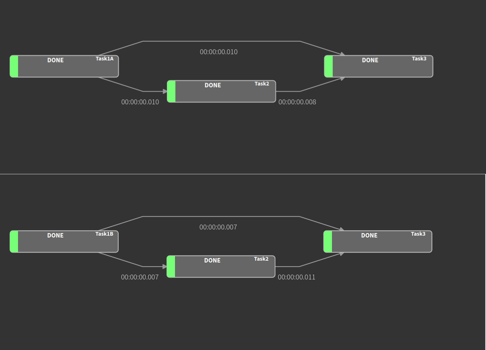
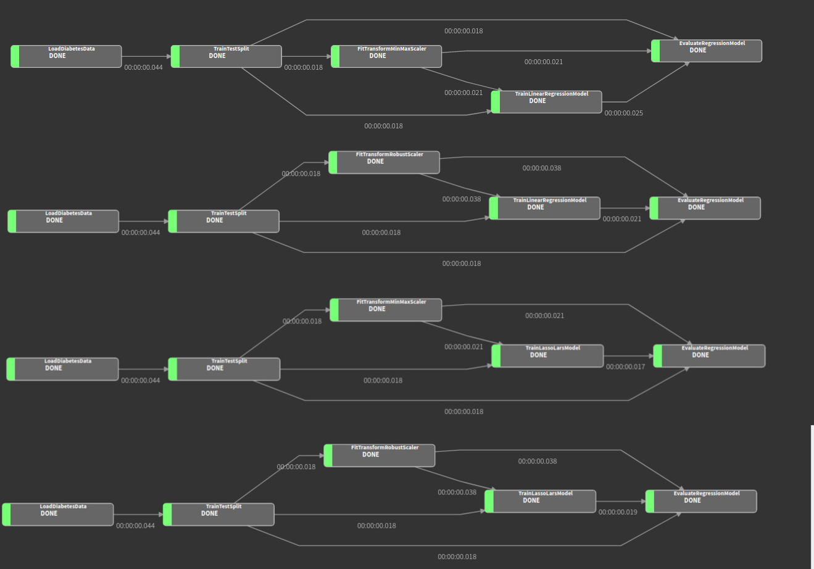
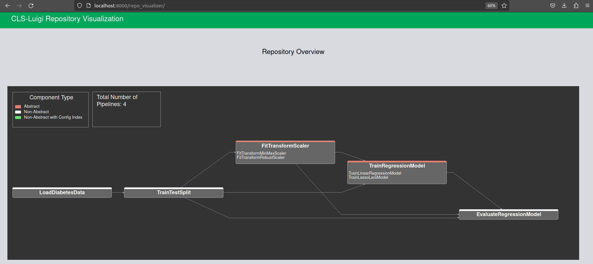
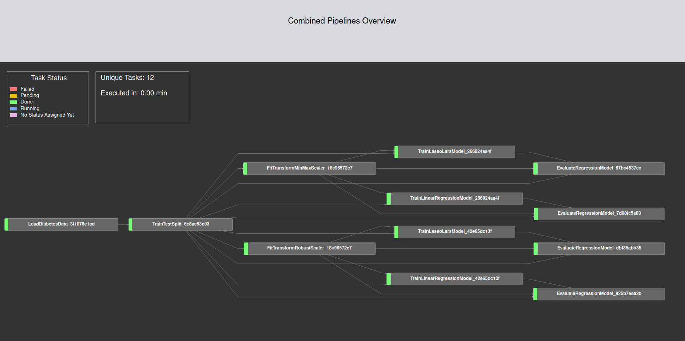
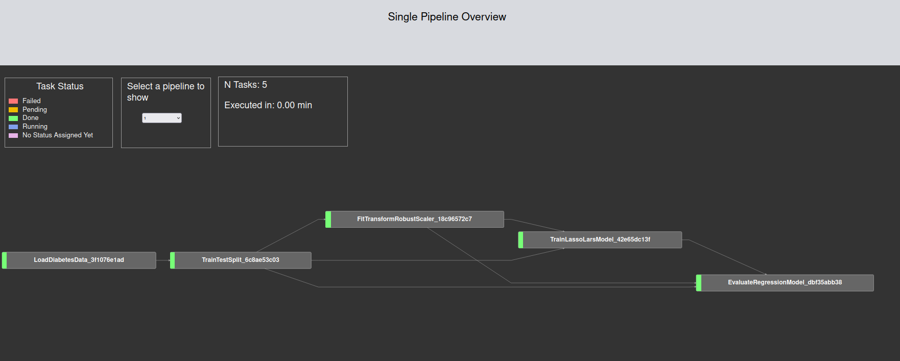

# cls-python

## Requirements for Your Development Environment 

To use cls-python, a python version >= 3.10 must be used. The implementation uses ["structural pattern matching"](https://peps.python.org/pep-0634/).
Verify you meet the requirements before trying to run any given example in this repository.

# cls-luigi

## Requirements for Your Development Environment

In order to be able to run cls-luigi you have to meet the requirements given for the usage of cls-python. Furthermore, some additional packages have to be installed (e.g. luigi itself) to be able to run the given examples in this repostory. For that we encourage the use of [pip](https://pip.pypa.io/en/stable/index.html).

We provide a [requirements.txt](requirements.txt) file that contains all the needed packages. To install them all in one take just use the following pip command: 
````bash
# make sure that you are in the right path
pip install -r requirements.txt 
````

### Known issues

1. There is a known [issue](https://github.com/spotify/luigi/issues/3202) when using Python 3.11 and using multiple workers. There is already a patch merged into main, but it seems like it is not yet in the release you get via pip.
For now it makes sense to just use python 3.10.
2. Luigi on Windows got some [problems](https://luigi.readthedocs.io/en/stable/running_luigi.html?highlight=windows#luigi-on-windows) due to the fact how windows is handling (or better not handling) forking of the python interpreter.

## What You need to know before You can start Your journey with cls-luigi

cls-luigi combines the pipelining tool [Luigi](https://luigi.readthedocs.io/en/stable/index.html) with the [(CL)S Framework](https://d-nb.info/1200209680/34). CLS is a Type-Theoretic Framework for Software Component Synthesis. In this case CLS is used to generate Luigi pipelines out of Luigi compontents. In our case a "component" is mostly a Luigi Task Class implementation. 

cls-luigi generates all feasible luigi pipelines for a given target based on a 
repository of luigi-tasks using cls-python.

A luigi tasks that not only inherit from ``luigi.Task`` but also 
from our LuigiCombinator ``inhabitation_task.LuigiCombinator`` are automatically considered as
luigi tasks that are part of the task repository.
All we need to implement is a pure luigi task, i.e., the methods ``run()``, ``output()`` and
``requires()``.

In the following we give a short intro of how to use cls-luigi. For each section, we also 
provide you with a running example in the folder hello_world_examples.

* [Run a pipeline consisting of one task](#rpc) 
* [Define dependencies on other tasks](#dfo)
* [Add variation points](#avp)
* [Variation points as a dependency](#vpa)

### Run a pipeline consisting of one task<a name="rpc"/>

The script for this example is to be found [here](hello_world_examples/_10_hello_world.py)

The following task simply writes "Hello World" to a file ``pure_hello_world.txt``:
````python
import luigi
import inhabitation_task

class WriteFileTask(luigi.Task, inhabitation_task.LuigiCombinator):

    def output(self):
        print("WriteFileTask: output")
        return luigi.LocalTarget('pure_hello_world.txt')

    def run(self):
        print("====== WriteFileTask: run")
        with self.output().open('w') as f:
            f.write("Hello World")
````

If only this task exists, a pipeline simply consists of this task. 
However, we can run it as follows:

````python
from inhabitation_task import RepoMeta
from cls_python import FiniteCombinatoryLogic, Subtypes

if __name__ == "__main__":
    target = WriteFileTask.return_type()
    repository = RepoMeta.repository
    fcl = FiniteCombinatoryLogic(repository, Subtypes(RepoMeta.subtypes))
    inhabitation_result = fcl.inhabit(target)
    max_tasks_when_infinite = 10
    actual = inhabitation_result.size()
    max_results = max_tasks_when_infinite
    if not actual is None or actual == 0:
        max_results = actual
    results = [t() for t in inhabitation_result.evaluated[0:max_results]]
    if results:
        luigi.build(results, local_scheduler=True) # für luigid: local_scheduler = True weglassen!
    else:
        print("No results!")
````

We determine our WriteFileTask as target. 
The repository is automatically generated with all LuigiCombinator tasks.
With fcl.inhabit(target) we ask if an inhabitant for this target exists over this repo.
As the number of resulting variants can be infinite, we only store ``max_tasks_when_infinite`` 
number of inhabitants in the results lists.
All inhabitants (luigi pipelines) are scheduled.

### Define dependencies on other tasks<a name="dfo"/>

The script for this example is to be found [here](hello_world_examples/_20_defining_dependencies.py)

The following task depends on the WriteFileTask.
It reads the file written in the WriteFileTask and substitutes "world" by "welt" and writes
a new file.
To determine this dependency, we define a class variable `write_file_class` and return it
in the `requires` method.
The rest of this class is "pure luigi".

````python
class SubstituteWeltTask(luigi.Task, inhabitation_task.LuigiCombinator):
    write_file_task = inhabitation_task.ClsParameter(tpe=WriteFileTask.return_type())

    def requires(self):
        return self.write_file_task()

    def output(self):
        return luigi.LocalTarget('pure_hello_welt.txt')

    def run(self):
        print("============= NameSubstituter: run")
        with self.input().open() as infile:
            text = infile.read()

        with self.output().open('w') as outfile:
            text = text.replace('World', "Welt")
            outfile.write(text)
````

Let's now define our target as ``target = SubstituteWeltTask.return_type()`` in the scripting
before.

```python
if __name__ == "__main__":
    target = SubstituteWeltTask.return_type()
    ...
```
Then a pipeline with the two tasks is scheduled.

### Add variation points<a name="avp"/>

To determine different pipelines, we have to add variation points.

#### Using inheritance
The script for this example is to be found [here](hello_world_examples/_30_generating_variation_by_inheritance.py)


Let's assume as an example that there exist two different variants for substituting the "world" 
string as variation point.
In this case, we define a task ``SubstituteNameTask`` as an abstract class, and propose two concrete 
implementations.

````python
class SubstituteNameTask(luigi.Task, inhabitation_task.LuigiCombinator):
    abstract = True
    write_file_task = inhabitation_task.ClsParameter(tpe=WriteFileTask.return_type())

    def requires(self):
        return self.write_file_task()


class SubstituteNameByAnneTask(SubstituteNameTask):
    abstract = False

    def output(self):
        return luigi.LocalTarget('pure_hello_anne.txt')

    def run(self):
        print("============= NameSubstituter: run")
        with self.input().open() as infile:
            text = infile.read()

        with self.output().open('w') as outfile:
            text = text.replace('World', "Anne")
            outfile.write(text)


class SubstituteNameByJanTask(SubstituteNameTask):
    abstract = False

    def output(self):
        return luigi.LocalTarget('pure_hello_jan.txt')

    def run(self):
        print("============= NameSubstituter: run")
        with self.input().open() as infile:
            text = infile.read()

        with self.output().open('w') as outfile:
            text = text.replace('World', "Jan")
            outfile.write(text)
````
As target, we use the abstract task ``target = SubstituteNameTask.return_type()``.

As a result three tasks are scheduled: SubstituteNameByAnneTask, SubstituteNameByJanTask and
WriteFileTask.
Note that the WriteFileTask is only scheduled once!

The output looks as follows:
````text
Scheduled 3 tasks of which:
* 3 ran successfully:
    - 1 SubstituteNameByAnneTask(config_index=, write_file_task={"__type__": "inhabitation_task.RepoMeta.WrappedTask", "module": "anne_test_3", "task_class": "WriteFileTask", "arguments": []})
    - 1 SubstituteNameByJanTask(config_index=, write_file_task={"__type__": "inhabitation_task.RepoMeta.WrappedTask", "module": "anne_test_3", "task_class": "WriteFileTask", "arguments": []})
    - 1 WriteFileTask(config_index=)

This progress looks :) because there were no failed tasks or missing dependencies
````

#### Using different configurations

The code of this example is to be found [here](hello_world_examples/_40_generating_variation_by_config.py)

Another way to produce variation points is to use different configuration.
Let's consider the same above example for substituting the "world" 
string as variation point.

First we implement both `SubstituteNameByJanTask` and `SubstituteNameByAnneTask` as a normal non-abstract task.
```python
class SubstituteNameByAnneTask(luigi.Task, LuigiCombinator):
    abstract = False
    write_file_task = inhabitation_task.ClsParameter(tpe=WriteFileTask.return_type())

    def requires(self):
        return self.write_file_task()

    def output(self):
        return luigi.LocalTarget('pure_hello_anne.txt')

    def run(self):
        print("============= NameSubstitute: run")
        with self.input().open() as infile:
            text = infile.read()

        with self.output().open('w') as outfile:
            text = text.replace('World', "Anne")
            outfile.write(text)


class SubstituteNameByJanTask(luigi.Task, LuigiCombinator):
    abstract = False
    write_file_task = inhabitation_task.ClsParameter(tpe=WriteFileTask.return_type())

    def requires(self):
        return self.write_file_task()

    def output(self):
        return luigi.LocalTarget('pure_hello_jan.txt')

    def run(self):
        print("============= NameSubstitute: run")
        with self.input().open() as infile:
            text = infile.read()

        with self.output().open('w') as outfile:
            text = text.replace('World', "Jan")
            outfile.write(text)
```

Then, in the `FinalTask` We pass both tasks as a single ClsParameter represented by a dictionary,
where the keys are our configuration index (1,"2"), and the items are the returned type of each task.

Note that defining a domain for our configurations indices is optional.
However, by defining a domain, we are specifying which variant is going to be implemented,
such that variants with configuration indices not in the domain will not be executed. 

````python
class FinalTask(luigi.WrapperTask, LuigiCombinator):
    substitute_name = ClsParameter(tpe={1: SubstituteNameByJanTask.return_type(),
                                        "2": SubstituteNameByAnneTask.return_type()})
    config_domain = {1, "2"}
    def requires(self):
        return self.substitute_name()
````
Side Note: As you can see, the `config_domain` can handle integers as well as strings simultaneously. 

Finally, we set `FinalTask` as our target as follows ``target = FinalTask.return_type()``.


There are 5 scheduled tasks in total:
* 2 FinalTask
* 1 SubstituteNameByJanTask
* 1 SubstituteNameByAnneTask
* 1 WriteFileTask


### Variation points as a dependency<a name="vpa"/>

A ready example is to be found [here](hello_world_examples/_50_variation_point_as_dependency.py)


When variation points are used as dependency in a following task, they must be uniquely identifiable by luigi,
such that their outputs won't be overwritten or considered as completed before they
are executed in other (later scheduled) pipelines.

For that we can use the output names of variation points as unique identifiers.

Here are the steps for that:
1. Make sure that each variation point has a unique output name in the `output` method (that's a
prerequisite of luigi anyway).
2. In the Task, where the variation point is "required", implement the such a method in order to
    uniquely identify the task:
    
   ````python
   from collections.abc import Iterable
   from pathlib import Path
    
    def _get_variant_label(self):
        if isinstance(self.input(), luigi.LocalTarget):
            label = self.input().path
            return Path(label).stem

        elif isinstance(self.input(), Iterable):
            var_label_name = list(map(
                lambda outputs: Path(outputs.path).stem, self.input()))
            return "-".join(var_label_name)
    ````
    
3. Use the `_get_variant_label` method in the output of the task in a similar manner:
    ````python
    def output(self):
        return luigi.LocalTarget(
            self._get_variant_label() + "-" + "output name of your choosing.suffix")
        # Using "-" between your variant label and the name of your choosing is recommended for better readability 
    ````

Note that You have to implement such a method in all subsequent tasks from here on, 
in order to avoid files being overwritten by subsequent (later scheduled) pipelines.

### Variation points usages in multiple tasks<a name="vpu"/>

In case a variation point is required by more than one task,
its concrete implementation may simultaneously get triggered more than once within the same pipeline.
Depending on your desired use-case you may want to filter out pipelines that includes multiple 
implementation of a given variation point. 

For that you can validate the inhabitation results before we must validate the inhabitation results before passing them to luigi.


#### Abstract example
The code for this example is to be found [here](hello_world_examples/_60_variation_point_multi_usage.py)

Consider this dummy pipeline where the variation point `Task1 Abstract` is a dependency for Task2 and
Task3. CLS-Luigi produces in this case 4 pipelines, 2 of which contain different implementations of the same 
variation point. 

If you wish to filter out those 2 pipelines, such that you will have the remaining pipelines in the image below, 
you must use the 'UniqueTaskPipelineValidator'. 




For that we must instantiate the `UniqueTaskPipelineValidator` with a list all abstract tasks
(whose outputs are used more than once), and them filter through them as follows:

```python
from unique_task_pipeline_validator import UniqueTaskPipelineValidator

validator = UniqueTaskPipelineValidator([Task1Abstract])
results = [t() for t in inhabitation_result.evaluated[0:max_results] if validator.validate(t())]
```
Now you may pass the results onto luigi as usual. 

#### ML-Pipeline example
The code for this example is to be found [here](hello_world_examples/_70_ML_example_variation_point_multi_usage.py)

Let's consider an example where we predict the blood sugar level of some patients.
In this example we first start by loading the dataset from Scikit-Learn, then we split it into 
2 subsets for training and testing.

The first variation point is the scaling method. We introduce 2 concrete implementation, namely `RobustScaler`&  `MinMaxScaler`.
After scaling we have our second variation point which is the regression model. Here we have also 2
concrete implementation, namely `LinearRegression` & `LassoLars`.

Lastly we evaluate each regression model by predicting the testing target and calculating the root mean squared error.


In this specific case we should have the following 4 pipelines: 




We can see that `RobustScaler` & `MinMaxScaler` is required by both the 
`TrainLinearRegressionModel` & `TrainLassoLarsModel`, and `EvaluateRegressionModel`

So the pipeline validation in this case looks like this:


```python
validator = UniqueTaskPipelineValidator([FitTransformScaler])
results = [t() for t in inhabitation_result.evaluated[0:max_results] if validator.validate(t())]
```

#### Using Dictionaries instead of lists in *requires* and *output* methods
Code for this example is to be found [here](hello_world_examples/_71_ML_example_with_dicts.py)

Till now, we only showed how to handle multiple dependencies and outputs using lists. However, lists can be akward to handle,
especially once you deal with nested lists. Indexes are just not very easily readable.

In the [last example](hello_world_examples/_70_ML_example_variation_point_multi_usage.py) used lists in the following way:

```python
    def output(self):
        return [
            luigi.LocalTarget("x_train.pkl"),
            luigi.LocalTarget("x_test.pkl"),
            luigi.LocalTarget("y_train.pkl"),
            luigi.LocalTarget("y_test.pkl")
        ]

    def run(self):
       ...
       ...
       ...
        X_train.to_pickle(self.output()[0].path)
        X_test.to_pickle(self.output()[1].path)
        y_train.to_pickle(self.output()[2].path)
        y_test.to_pickle(self.output()[3].path)
```
Note how we defined our outputs in *output* method, had feed in the index number of corresponding LocalTarget in the *run* method. We can do better!

##### solution
We can use dictionaries instead of lists, and reference the corresponding LocalTargets using keys:

if your haven't looked at the 
code for this example, you can also find it [here](hello_world_examples/_71_ML_example_with_dicts.py)


```python
class TrainTestSplit(luigi.Task, LuigiCombinator):
    abstract = False
    diabetes = inhabitation_task.ClsParameter(tpe=LoadDiabetesData.return_type())

    def output(self):
        return {
            "x_train": luigi.LocalTarget("x_train.pkl"),
            "x_test": luigi.LocalTarget("x_test.pkl"),
            "y_train": luigi.LocalTarget("y_train.pkl"),
            "y_test": luigi.LocalTarget("y_test.pkl"),
        }
    
    def run(self):
        data = pd.read_pickle(self.input()["diabetes_data"].path)
        X = data.drop(["target"], axis="columns")
        y = data[["target"]]
        X_train, X_test, y_train, y_test = train_test_split(X, y, test_size=0.33, random_state=42)

        X_train.to_pickle(self.output()["x_train"].path)
        X_test.to_pickle(self.output()["x_test"].path)
        y_train.to_pickle(self.output()["y_train"].path)
        y_test.to_pickle(self.output()["y_test"].path)
```
This is way easier to read! By using dictionaries we don't need to memorize the indexes of elements or even car about
their order. We can just use the keys without having to go back searching for the write index.

Note: You can use this way in your *requires* method as well. and instead of referencing as follows: 
 ```python
self.input()[some index]
```

your can just do the following:
```python
self.input()["Your Cool Key"]
```

#### CLS-Luigi Visualizer

The code for this example is to be found [here](hello_world_examples/_80_cls_luigi_visualizer.py)
Let's consider the same ML-pipeline from above for this example.

In order to visualize your pipelines, make sure to follow these steps in advance:


1. Initialize `StaticJSONRepo` with RepoMeta as follows: 
    ```python
    from repo_visualizer.static_json_repo import StaticJSONRepo
   
    target = EvaluateRegressionModel.return_type()
    repository = RepoMeta.repository
    StaticJSONRepo(RepoMeta).dump_static_repo_json()
   # dump_static_repo_json() saves the generated json file
    ```

2. Initialize `DynamicJSONRepo` with the evaluated/validated inhabitation results:
(make sure that local_scheduler is set to False)
    ```python
    from repo_visualizer.dynamic_json_repo import DynamicJSONRepo
 
    validator = UniqueTaskPipelineValidator([TrainRegressionModel, FitTransformScaler])
    results = [t() for t in inhabitation_result.evaluated[0:max_results] if validator.validate(t())]

    if results:
        DynamicJSONRepo(results).dump_dynamic_pipeline_json()
        print("Number of results", max_results)
        print("Number of results after filtering", len(results))
        print("Run Pipelines")
        luigi.build(results, local_scheduler=False, detailed_summary=True)
    else:
        print("No results!")
    ```
3. Execute the following command in your terminal to start the Luigi Daemon, and the visualizer Server:
     ```
    python repo_visualizer/visualizer.py
   ```
   
4. Run your pipeline-script now and navigate to `http://localhost:8000/repo_visualizer/` in your browser.

<br/>

The Repository Overview is a compressed representation of all pipelines, and displays a summary of all the pipelines and their component types in RepoMeta as follows:  
- None-Abstract components which are not concrete implementations of any abstract or indexed component are labeled in white.
- Abstract components are labeled in red. Their concreate implementations are listed underneath the corresponding abstract component. 
- Components that contain config indices are labeled in green. Their config indices as well as the indexed components are listed underneath them (similar to Abstract components).
<br/>


<br/>
<br/>
<br/>


The  Combined Pipelines Overview combines all running Luigi-pipelines into one, such that mutual components are only shown once. The status of the components is updated in real-time.
<br/>




Finally, you can select and see single pipelines in the last section


