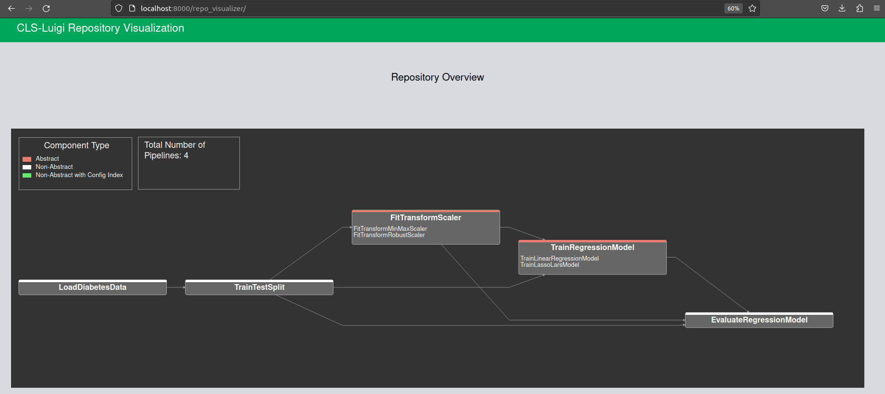

Getting Started
===============

The purpose of this guide is to illustrate some of the main features that **cls-luigi** provides. It assumes a very basic knowledge of python. Please refer to our :doc:`installation instructions <../../installation>` for installing **cls-luigi**.

**cls-luigi** is an open source pipeline tool

Sub-heading
-----------

Paragraphs are separated
by a blank line.

test
^^^^

testdsdsd sdsd
