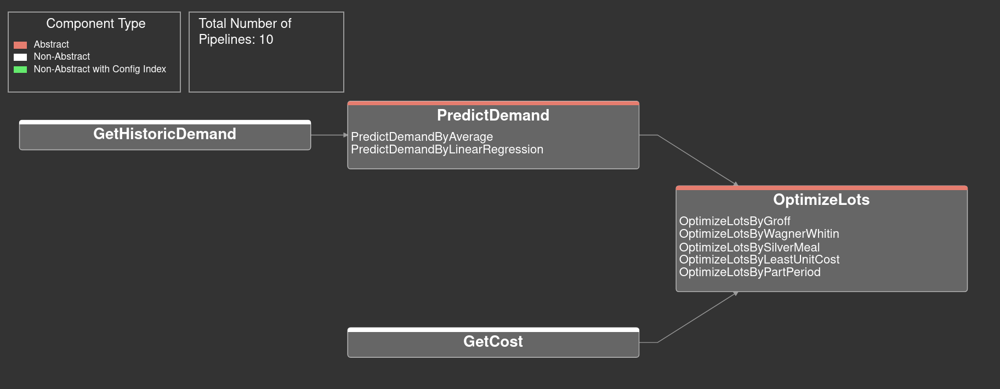
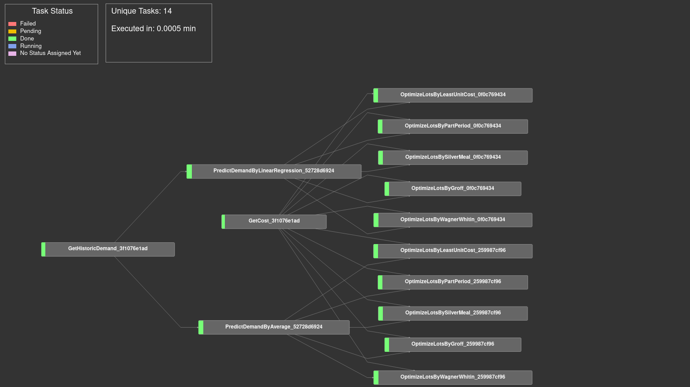

Lot Sizing Example
==================

You can find the source for the example `here <https://github.com/cls-python/cls-luigi/tree/main/examples/lot_sizing/>`_:

Here we utilized CLS-Luigi to construct demand prediction pipelines for lot sizing. The example was built to present CLS-Luigi at the `LION17 <https://lion17.org/>`_ conference.

Requirements
------------

The example contains a `requirements.txt <https://github.com/cls-python/cls-luigi/tree/main/examples/ny_taxi/requirements.txt>`_ file. To experiment with the example, you can set up your environment by executing the following command:

.. code-block:: bash
    :linenos:

    # cd into the lot sizing example folder
    pip install -r requirements.txt

Static Visualization
--------------------

Dynamic Visualization
---------------------

