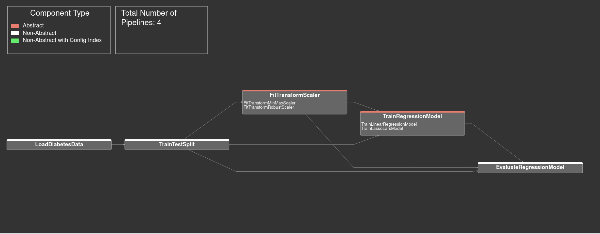
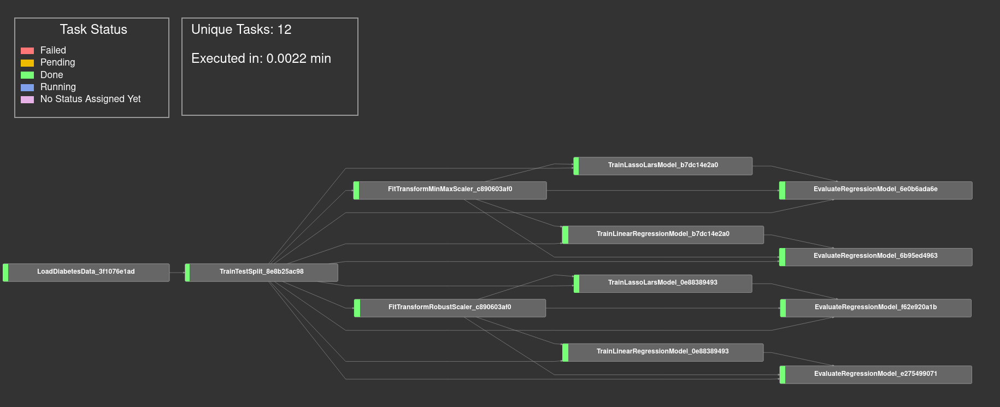

ML-Blood Sugar Level Example
============================

You can find the source for the example `here <https://github.com/cls-python/cls-luigi/tree/main/examples/ml_blood_sugar_level/>`_:

Here we used CLS-Luigi to create a ML Pipeline to predict the blood sugar level of some patients.
The Steps are very easy to understand. We start by loading the dataset from Scikit-Learn, then we split it into 2 subsets for training and testing.

The first variation point is the scaling method. We introduce 2 concrete implementation, namely ``RobustScaler`` & ``MinMaxScaler``.
After scaling we have our second variation point which is the regression model. Here we have also 2 concrete implementation, namely ``LinearRegression`` & ``LassoLars``.

Lastly we evaluate each regression model by predicting the testing target and calculating the root mean squared error.

``variant_1.py`` and ``variant_2.py`` both implement the same pipeline, but in ``variant_2.py`` we tested out to use dictionaries for
the ``required`` and ``output`` methods of tasks to get overall a more understandable and easier-to-read source code. For more
information on that, check out the :doc:`getting started tutorial <../getting_started/README>`

Requirements
------------

The example contains a `requirements.txt <https://github.com/cls-python/cls-luigi/tree/main/examples/ml_blood_sugar_level/requirements.txt>`_ file. To experiment with the example, you can set up your environment by executing the following command:

.. code-block:: bash
    :linenos:

    # cd into the ml blood sugar level example folder
    pip install -r requirements.txt

Static Visualization
--------------------

Dynamic Visualization
---------------------

