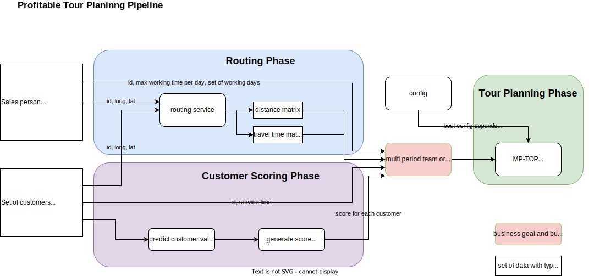

Vehicle Routing Example
=======================

You can find the source for the example `here <https://github.com/cls-python/cls-luigi/tree/main/examples/vehicle_routing/>`_:

Here we utilized CLS-Luigi to construct vehicle routing pipelines for sales persons. This was a master thesis topic.
The goal was to get as close as possible to the original modeling of the pipeline to test out the abilities of CLS Luigi.

Requirements
------------

The example contains a `requirements.txt <https://github.com/cls-python/cls-luigi/tree/main/examples/ny_taxi/requirements.txt>`_ file. To experiment with the example, you can set up your environment by executing the following command:

.. code-block:: bash
    :linenos:

    # cd into the vehicle routing example folder
    pip install -r requirements.txt

The Pipeline
------------

This is an overview of the pipeline implemented during the master thesis:

Here is an overview of what I planned to implement:

.. figure:: images/pipeline_to_implement.svg
   :class: fullscreen-image

How to run
----------

You need to set an Environment Variable “DISTANCEMATRIXAIAPI” with a valid API_Key since i used this Service during the routing phase. If you do not wish to run this Service, you could exclude the implementation of the “DistanceMatrixAiRoutingPhase” Class and only use the “OsrmRoutingPhase” Class. This one need a running ORSM and Nominatin Docker Container running on your local system. Change directory into the
variant folders and run *“python tour_planning_tasks.py”*.
