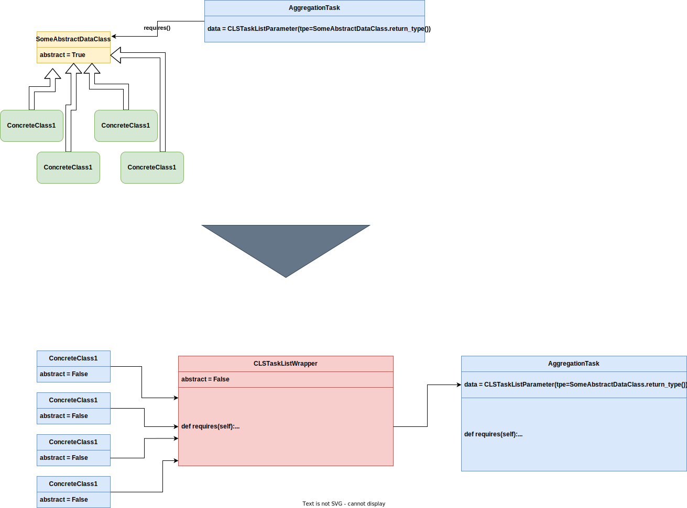

# Vehicle Routing Example

Here i was trying to implement an example vehicle routing pipeline that was created during my master thesis.
The aim was to get as close as possible to the original modeling of the pipeline to test out the abilities
of CLS Luigi and get used to it.

This is an overview over what i intended to implement:


## How to run

You need to set an Environment Variable "DISTANCEMATRIXAIAPI" with a valid API_Key since i used this Service
during the routing phase. If you do not wish to run this Service, you could exclude the implementation of the
"DistanceMatrixAiRoutingPhase" Class and only use the "OsrmRoutingPhase" Class. This one need a running ORSM and Nominatin Docker Container
running on your local system.
Change directory into the variant folders and run "python tour_planning_tasks.py".

## New Features implemented/tested while working on the example

1. You are now able to use Dictionaries in your requires and output functions.
   1. this makes it possible to be more explicit while implementing your tasks. makes it more understandable since you can actually use names for the results.
   2. For that i had to implement small changes to the "UniqueTaskPipelineValidator" and the "_get_variant_label" function.
2. Many new methods for RepoMeta to get information about a task node (mainly information about abstract/concrete classes up- or downstream).
   1. also what are shared upstream classes between nodes.
3. Repository filter methods to specify which tasks you want to include or exclude during inhabitation.
4. Helper method in RepoMeta to get an "unique abstract task" Validator based on the current Repository without the need to specify them by hand.
   1. This idea was born due to the fact that we always threw all abstract tasks into the UniqueTaskPipelineValidator.
   2. This method gives you all abstract tasks that were variated in the given pipeline/s, since those are the only tasks that you really want to be unique.
5. Running CLSLuigi Pipeline as a Luigi.Task.
6. A idea to implement a wrapper task that is actually providing output to the next task.
   1. not tested yet.

      1. ```python
            import luigi

            class MyWrapperTask(luigi.WrapperTask):
                def requires(self):
                    # yield a list of tasks that the wrapper task depends on
                    yield MyTask1()
                    yield MyTask2()
                    yield MyTask3()

                def run(self):
                    # do something with the outputs of the yielded tasks
                    with self.input()[0].open() as f1:
                        data1 = f1.read()
                    with self.input()[1].open() as f2:
                        data2 = f2.read()
                    with self.input()[2].open() as f3:
                        data3 = f3.read()
                    # combine the outputs of the tasks
                    output = data1 + data2 + data3
                    # write the combined output to the output file
                    with self.output().open('w') as f:
                        f.write(output)

                def output(self):
                    return luigi.LocalTarget('/path/to/output')


            class MyWrapperWithPassThrough(luigi.WrapperTask):

                def requires(self):
                    # yield a list of tasks that the wrapper task depends on
                    yield MyTask1()
                    yield MyTask2()
                    yield MyTask3()
                    
                def run(self):
                    pass
                
                def output(self):
                    return {"MyTask1_result": self.input()[0], "MyTask2_result": self.input()[1], "MyTask3_result": self.input()[2]}
         ```

   2. could be useful to have a node that brings the pipelines together again.
   3. The idea could be further worked on to have some new ClsParameter to do something like this:
      1. 

## Biggest problems while working on this

1. It is hard to understand how to use luigi.config. The documentation on that is very slim and not that verbose. So the way i used luigi.config during my implementation efforts is most likely wrong. What i gathered during my research, can be found in the files "stuff/luigi_config_example.py" and "stuff/luigi_configuration_example.py". I think those variants shown there are the way to go.
2. Since the usage of config and configuration was unclear, i had problems setting up the modeling of my pipeline. I was planning on using the Luigi.Parameter Defaults (ClsParameter is also a Luigi.Parameter) to set up my basic structure of the Pipeline, meaning if i do not use any parametrization or config/configuration i would get all variants that are possible ("everything with everything"). And then would like to be able to parameterize the Pipeline Model to fit my needs.
   1. The main problem steams from the fact that i was unable to parametrizes ClsParameter or Tasks that have a ClsParameter in it. The moment i tried to parametrizes it (with or without the ClsParameter) i got errors according to giving too few parameters (When not trying to parametrizes the ClsParameter) or to many (in case i tried to set it). To this day i am not sure if it is really not possible or i am just doing "wrong" python.
3. I find the way we do Aggregation Tasks, e. g. finding "the best result" of all pipelines that were scheduled or creating a scoring board (EvaluateAndVisualize Task in Example "ny_taxi_paper.py) troubling since it relays on the fact that the tasks do not run concurrently (which they can given the number of works involved). Right now they are all just reading/writing a single property, in this case the file on the filesystem, without a method of locking/releasing. Could lead to overwrite or inconsistent data. This is one of the reasons for me to think about the new Wrapper Tasks, if that could even be implemented. 
