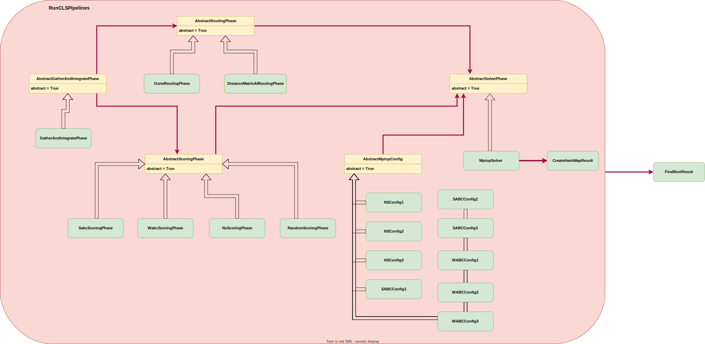

# Variant 2

This variant implements the pipeline shown in pipeline_to_implement.svg.
Everything is the same as in variant_1 except that instead of running an
AggregationTask in every pipeline and relay on "luck" reading and writing
the same file with multiple concurrent tasks, we implemented a LuigiTask that
runs CLSLuigi (and all resulting Pipelines from that run) and uses to result to
then extract the pipeline with the best ObjVal result.

## Implemented pipeline structure:

## potential downsides

- you have to know the structure of the results and does be able to get the files by knowing the corresponding paths.
  - it would be nice to run  luigi.build(results, ...) in the cls runner task, and somehow get a collection/iterable of all the results from the last task in every pipeline. This could then be passed to the aggregation task and used explicitly.
